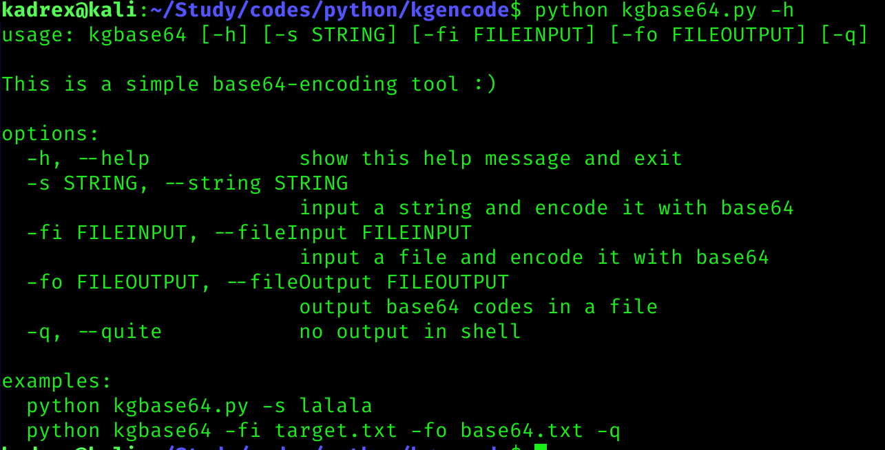
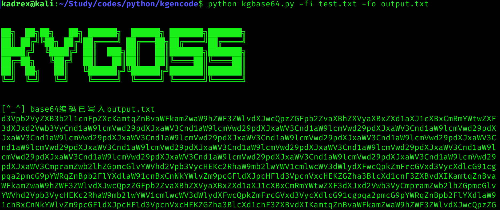

# 简介
1. kgbase64: 这是一个简单的base64编码工具，可以将你所输入的字符串或文件里的内容编码为base64并输出到屏幕上或者其他文件里。使用`python kgbase64.py -h`以获取更多信息。    
2. kgdecode64: 这是一个简单的base64解码工具，可以将文件里的base64转换为字符串。使用`python kgdecode64.py -h`以获取更多信息。  

# 使用例子
  
  
  
  
  
